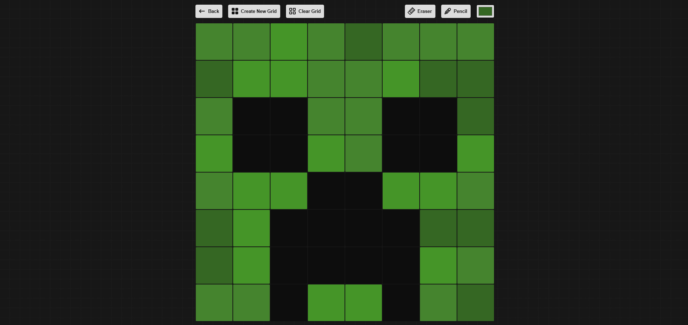

 

Select Language: [Português](./README-ptbr.md) | [English](./README.md)

# Etch‑a‑Sketch - The Odin Project  
   

Projeto feito durante os estudos com [The Odin Project](https://www.theodinproject.com/) (TOP).  

O [TOP](https://www.theodinproject.com/) é um roteiro de estudos open-source voltado para o aprendizado de desenvolvimento web full-stack. Este é um dos projetos propostos no curso: um Etch‑a‑Sketch (quadro mágico) direto no navegador.

## Preview  
Você pode acessar o site online [aqui](https://wagnertomaz.github.io/etch-a-sketch/)

## Objetivo  
O objetivo principal deste projeto foi aplicar e praticar os conceitos de JavaScript ensinados no [The Odin Project](https://www.theodinproject.com/), incluindo funções, manipulação do DOM, laços de repetições e eventos, recriando o brinquedo Etch‑a‑Sketch no navegador.

## Conteúdo  
Este Etch-a-Sketch permite desenhar em uma grade personalizável diretamente no navegador. A grade é gerada dinamicamente com JavaScript, e você pode definir o tamanho (até 100 quadrados por lado).  

A aplicação inclui recursos como:
- Desenhar passando o mouse sobre os quadrados da grade.
- Apagar quadrados individuais com o modo borracha.
- Escolher cores personalizadas usando um seletor de cores.
- Pintar com um pincel que usa cores aleatórias.
- Limpar todo o quadro com um clique.
- Criar novas grades informando o tamanho desejado.

Foi um desafio divertido que ajudou a reforçar meu entendimento sobre eventos no DOM, loops e criação dinâmica de elementos. Também aproveitei para experimentar mais com Flexbox e interação com a interface.

## Contribua  
Se você encontrar algum bug ou tiver sugestões de melhorias, fique à vontade para abrir uma issue ou enviar um pull request no repositório.
